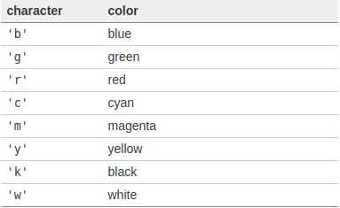
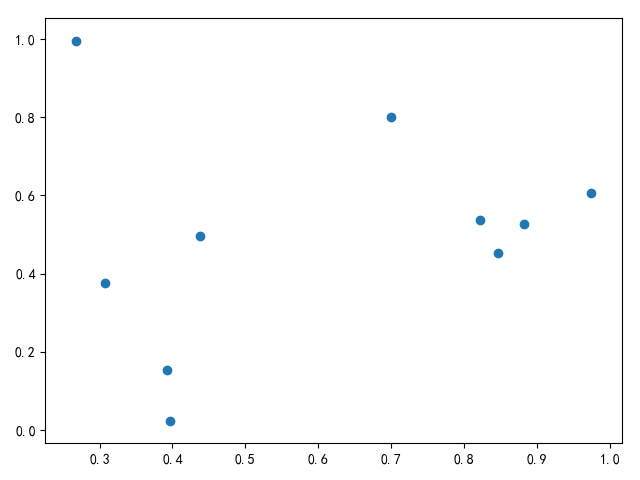
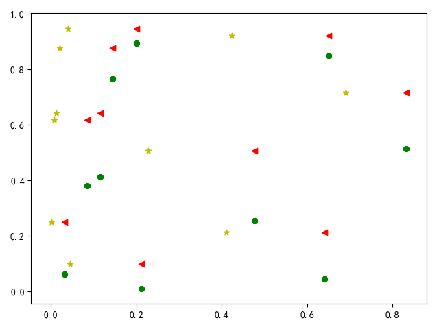

# 散点图

绘制散点图使用函数[matplotlib.pyplot.scatter](https://matplotlib.org/api/_as_gen/matplotlib.pyplot.scatter.html#matplotlib.pyplot.scatter)

```
matplotlib.pyplot.scatter(x, y, s=None, c=None, marker=None, cmap=None, norm=None, vmin=None, vmax=None, alpha=None, linewidths=None, verts=None, edgecolors=None, *, data=None, **kwargs)[source]
```

参数`x,y`是数组形式，表示数据位置

参数`c`表示颜色，可选颜色值参考[格式化绘图样式](https://zj-image-processing.readthedocs.io/zh_CN/latest/matplotlib/%E6%8A%98%E7%BA%BF%E5%9B%BE.html#id2)



* b：蓝色
* g：绿色
* r：红色
* c：青色
* m：紫红
* y：黄色
* k：黑色
* w：白色

参数`marker`表示图标形状，可选值参考[MarkerStyle](https://matplotlib.org/api/_as_gen/matplotlib.markers.MarkerStyle.html#matplotlib.markers.MarkerStyle.filled_markers)

```
filled_markers = ('o', 'v', '^', '<', '>', '8', 's', 'p', '*', 'h', 'H', 'D', 'd', 'P', 'X')
```

## 示例

简单的散点图

```
# -*- coding: utf-8 -*-

import matplotlib.pyplot as plt
import numpy as np

if __name__ == '__main__':
    fig = plt.figure()

    x = np.random.rand(10)
    y = np.random.rand(10)

    plt.scatter(x, y)

    plt.show()
```



使用颜色和`maker`标记多条散点图

```
import matplotlib.pyplot as plt
import numpy as np

if __name__ == '__main__':
    fig = plt.figure()

    x = np.random.rand(10)
    y = np.random.rand(10)

    plt.scatter(x, y, c='r', marker='<')
    plt.scatter(x, y ** 2, c='g', marker='8')
    plt.scatter(x ** 2, y, c='y', marker='*')

    plt.show()
```

